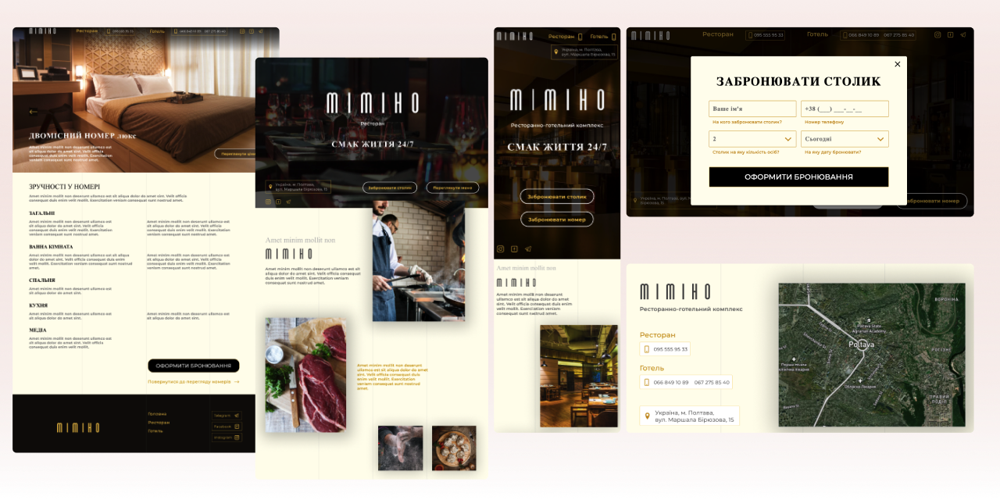

# Mimino

Mimino is a multi-page website for a hotel and restaurant complex.
This project showcases the various features and offerings of the complex, providing an interactive and informative online presence.

## Features
- **Responsive Design:** The website is designed to be fully responsive, ensuring a seamless user experience on different devices, including desktops, tablets, and mobile phones.
- **Modal Windows for Booking:** Users can make reservations for hotel rooms and restaurant tables through interactive modal windows. This streamlined process enhances user convenience.
- **Image Sliders:** Sliders are implemented to allow users to view photos of hotel rooms and restaurant dishes, providing a visually appealing way to showcase the complex's offerings.

## Project Goals
The primary goal of the Mimino project is to increase interest in the hotel and restaurant complex by presenting all the advantages of staying and dining at the complex.
The user-friendly interface and quick reservation system for rooms and tables aim to boost room bookings and restaurant visits.

## Technologies Used
- HTML
- CSS / SASS
- JavaScript

